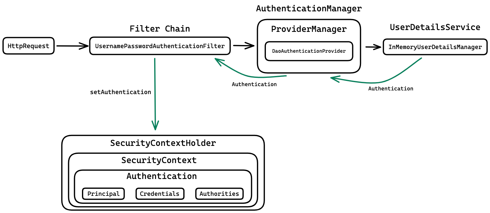

## Spring Boot JWT


# Stack


***

## Login flow


## Authentication flow

## Core Code

1. `JWTUtil`
2. `JWTAuthFilter`
3. `JWTAuthEntryPoint`
4. `CustomUserDetailsService`
5. `SecurityConfig`
   
## Configure Spring Datasource, JPA, App properties
Open `src/main/resources/application.properties`

```properties
spring.datasource.url=jdbc:mysql://localhost:3306/testdb?createDatabaseIfNotExist=true
spring.datasource.username= your_username
spring.datasource.password= your_password

#properties for MySQL
spring.jpa.show-sql=true
spring.jpa.hibernate.ddl-auto=update
spring.jpa.properties.hibernate.format_sql=true

#JWT Token
#base64(256 bits)
spring.security.jwt.secret=6k9YeP6LdZf27PaMM2PGRbM11XqAfQsHcFQt2uLAV/U=
#1min
spring.security.jwt.expirationMs=60000


```
## Run following SQL insert statements
All users registered via the registration endpoint are assigned the 'user' role by default. To assign admin privileges, please manually insert the admin credentials into the register table.<b>Password - BCryptEncoded</b>
```
INSERT INTO register (reg_id,email, first_name, last_name , password , role)
VALUES (1,'admin@gmail.com', 'admin','A','$2a$10$uBwznt.UGsEY1zahgdYyguDSIyME085OT15fjTz5I4HYtPwmPokEO','ADMIN');
```
Ensure that the employee table contains data to retrieve information when accessing the /admin/emplist endpoint. You can also use Postman to insert data.
```
INSERT INTO employee (empId, empName, dept, gmail, phno, dob, gender, salary, joinDate) VALUES 
(1, 'Michael Johnson', 'Sales', 'michael.johnson@gmail.com', '8786543210', '1988-11-11', 'male', 80000, '2020-12-01');

```

## How to use this code?


1. Make sure you have [Java 17 or 21](https://www.java.com/download/) and [Maven](https://maven.apache.org) installed

2. Fork this repository and clone it
  
```
$ git clone https://github.com/<your-user>/SpringSecurity6-JWT_RBAC-MYSqlConnection
```

3. Navigate into the folder  

```
$ cd SpringSecurity6-JWT_RBAC-MYSqlConnection
```

4. Install dependencies

```
$ mvn install
```

5. Run the project

```
$ mvn spring-boot:run
```

6. Open Postman

7. Make a GET request to `/admin/emplist` to check you're not authenticated. You should receive a response with a `401` with an `Unauthorized` message since you haven't set your valid JWT token yet


8. Make a POST request to `/signin` with the default admin user we programatically created to get a valid JWT token

```
$  POST 'http://localhost:8080/signin

#with body
{
    "username":"admin@gmail.com",
    "password":"admin@123"
}
```

9. Add the JWT token as a Header parameter and make the initial GET request to `/admin/emplist` again

```
$ GET http://localhost:8080/admin/emplist -H 'Authorization: Bearer <JWT_TOKEN>'
```

10. And that's it, congrats! You should get a similar response to this one, meaning that you're now authenticated

```json
{
    "empId": 1,
    "empName": "Michael Johnson",
    "dept": "Sales",
    "gmail": "michael.johnson@gmail.com",
    "phno": "8786543210",
    "dob": "1988-11-11T00:00:00.000+00:00",
    "gender": "male",
    "salary": 80000,
    "joinDate": "2020-12-01T00:00:00.000+00:00"
}

```
## Demo Video

Check out my [LinkedIn profile](https://www.linkedin.com/in/madhumiga-vijayakumar-b51aa4255/) for a demo video of this project.

Happy Coding!😊👨‍💻👩‍💻
